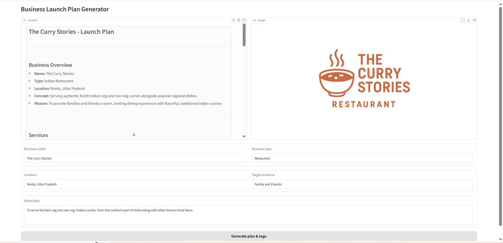
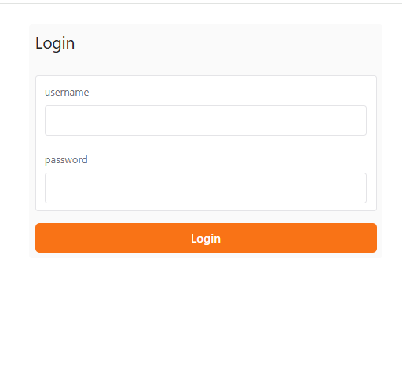

# New Business Concept Planner

This project helps someone plan a new local business idea before launch. It works well for:

- restaurants
- clinics
- gyms

The notebook generates a practical concept summary that includes:

- business overview
- services
- target audience
- strengths
- marketing suggestions
- early website and brand direction

## Preview




*If the image does not show, save the screenshot as* `assets/preview.PNG` *relative to the project root.*

## Recent changes (most recent first)

1. Streaming responses (text)
   - Before: The notebook requested a single JSON object response and waited for the full output.
   - Changed: Replaced the blocking JSON-only call with a streaming chat completion, printing/updating partial markdown as chunks arrive.
   - How it works: The app now consumes streamed chunks from the chat completion API and updates the UI progressively.
   - Advantages: Faster perceived response time, users see content as it is generated, and partial results can be reviewed earlier.

2. Gradio chat interface
   - Before: The notebook printed results to the Jupyter output area after the call completed.
   - Changed: Added a Gradio Blocks chat-style UI so users can enter business fields conversationally and receive streamed answers in a chat box.
   - How it works: The Gradio app accepts inputs, streams the assistant's text output back into a `Chatbot` component, and returns the full plan.
   - Advantages: More interactive, easier for non-technical users, and supports conversational follow-ups.

3. Logo generation (Images)
   - Before: The notebook produced only textual plans and did not generate any images.
   - Changed: Added a logo-generation step that calls the OpenAI Images API to create a simple logo based on the business name, type, and brand idea, and displays it alongside the chat output.
   - How it works: After streaming the text plan, the app requests a logo image (base64) from the Images API, decodes it, and shows it in an `Image` box next to the chat window.
   - Advantages: Provides a quick visual identity sketch, useful for brainstorming brand concepts and sharing with designers.

## Files

- `insight.ipynb` – main notebook and app for planning a new local business concept
- `README.md` – project overview and recent changes

## Requirements

Before running the notebook, make sure you have:

- Python installed
- a `.env` file in the project folder
- an OpenAI API key in the `.env` file as:

```env
OPENAI_API_KEY=api_key
```

You may also need these Python packages installed:

```bash
pip install python-dotenv openai ipython gradio
```

## How to use

1. Open `insight.ipynb` in VS Code.
2. Run the setup/import cell.
3. Launch the Gradio chat app with:

```python
demo = launch_gradio_app()
# If GRADIO auth is set in .env, the app will require the username/password.
import os
from dotenv import load_dotenv
load_dotenv()
auth_user = os.getenv("GRADIO_AUTH_USER")
auth_pass = os.getenv("GRADIO_AUTH_PASS")

demo.launch(share=True, auth=(auth_user, auth_pass) if auth_user and auth_pass else None)
```

4. Enter the details in the chat interface:
   - business name
   - business type
   - location
   - target audience
   - brand idea
5. The assistant will generate a local business launch plan in the chat output.

## Authentication

The Gradio app supports optional basic auth to restrict access. Set the following values in the `.env` file in the `Projects/` folder:

```env
GRADIO_AUTH_USER=username
GRADIO_AUTH_PASS=password
```

If both values are present when the notebook loads, the Gradio app will require the username/password to open. The notebook also supports launching without auth if these variables are not set.

Example credentials screenshots:




The first image shows a successful login flow when valid `GRADIO_AUTH_USER`/`GRADIO_AUTH_PASS` values are provided. The second image shows the app's response when incorrect credentials are entered.

## Example chat flow

The app asks questions in this style:

- Business name: The Curry Stories
- Business type: Restaurant
- Location: Noida, Uttar Pradesh
- Target audience: Family and Friends
- Brand idea: To serve the best veg and non-veg Indian curries from the northern part of India along with other famous food items

The response is generated directly in the chat interface as a streamed output and a generated logo image is shown to the right (see preview above).

## Notes

- The notebook is designed for a new business concept, not an existing company.
- It does not need an existing website or live URL to be useful.
- You can later extend it with pricing, competitor analysis, location strategy, and homepage sections.
- The project has been updated recently to better support interactive, user-friendly launch planning.
